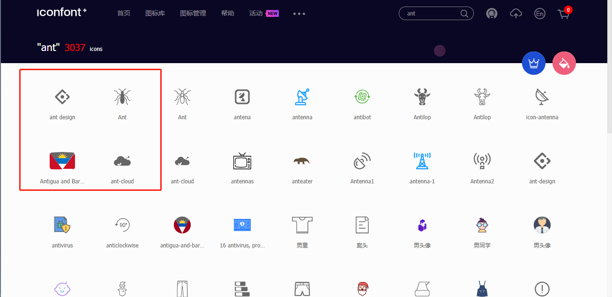
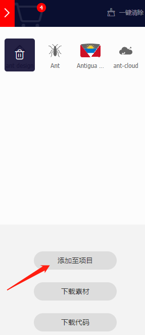
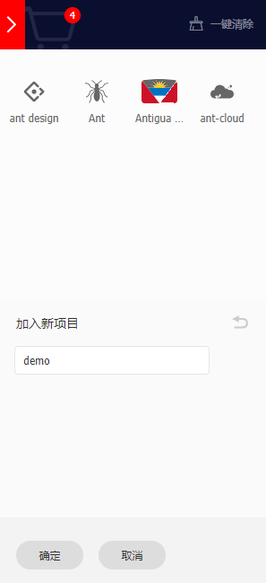
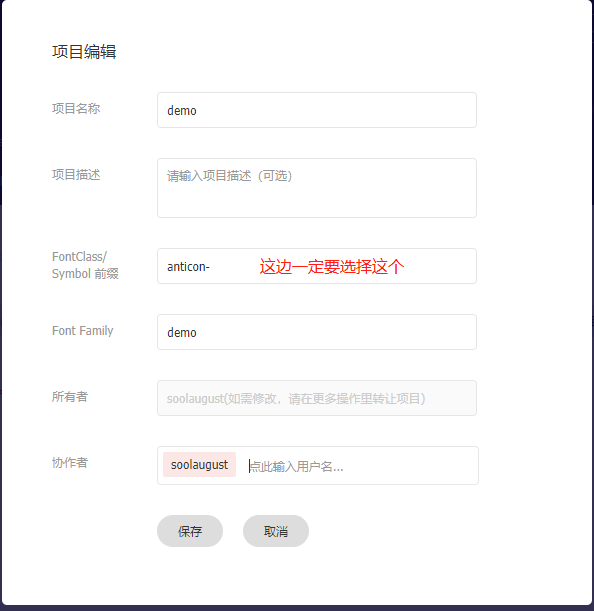
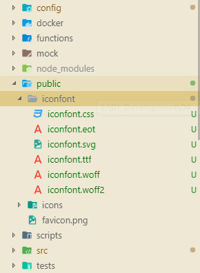

<h1>菜单栏使用自定义Icon （iconfont.cn）</h1>

最近因为项目的要求，需要更改 Ant Design Pro 的菜单栏图标。找了一大圈资料，踩了不少的坑，最后才完成。所以这里记录下过程。

## 在iconfont上找寻自己需要的图标

以“Ant”为例，比如说我们需要下面的这几个图标：



首先加入到购物车中，然后点击购物车，如下图所示：



选择添加到项目中，然后新建项目：



这时会跳转到项目页面，点击“更多操作”选择“编辑项目”：



编辑好了之后，选择下载到本地，然后解压后将里面iconfont*开头的文件放到项目的`/public`下面，如下图所示：



然后在 `/src/global.less` 中添加下面的代码(这里其实可以不在这里添加，新建一个也可以）

```less
@import '/iconfont/iconfont.css';

:global(.anticon) {
  &:before {
    font-family: 'anticon', 'demo' !important; // 'demo' 对应上面编辑项目时的 'Font Family'
    display: inline-block;
  }
}
```

然后在`/src/components/Sidemenu/BaseMenu.js`中改写`getIcon`逻辑：

```js
const getIcon = icon => {
  if (typeof icon === 'string' && icon.indexOf('http') === 0) {
    return ;
  }
  if (typeof icon === 'string' && icon.indexOf('anticon-') === 0) {
    return <Icon type={icon.replace('anticon-', '')} className="demo" />;
  }
  if (typeof icon === 'string') {
    return <Icon type={icon} />;
  }
  return icon;
};
```

这样更改完成后就可以直接在`router.config.js`上使用自己定义的图标了，比如iconfont项目里的`anticon-ant-cloud`（可以直接到iconfont项目页面中选择复制代码）：

```js
...
icon: "anticon-ant-cloud"
...
```